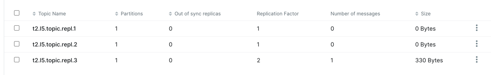
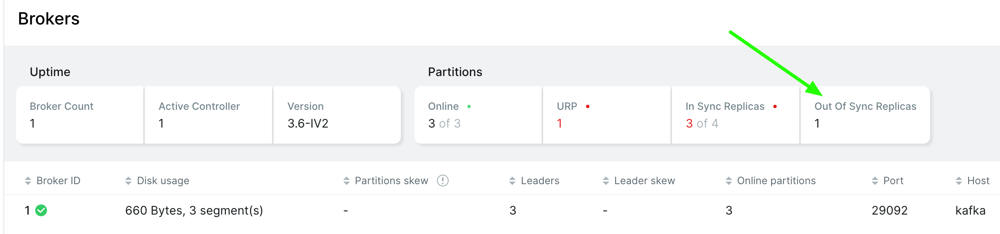
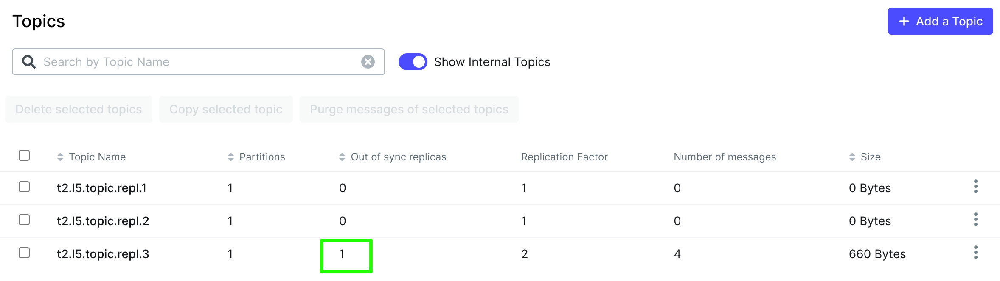

# Настройка репликации через код

1. Перешел на confluent_kafka
2. Создать топик с дефисами не получается и ошибок нет
3. Создать топик с replication_factor>1, если реплика только 1, не получается, но и ошибок нет
4. Создать топик с конфигом

```python
    topic = NewTopic(topic=topic_name,
                     num_partitions=1,
                     replication_factor=1,
                     config={"min.insync.replicas": "2"}
                     )
```

Можно, но отправить сообщение нельзя


## Добавление брокера

Для проверки п3-4 добавил еще брокер, конфиг [docker-compose.kafka-add-broker.yaml](../../infra/docker-compose.kafka-add-broker.yaml)

Топики с репликацией добавляются успешно:




# Проверка репликации

Отключаем один брокер:

```bash
docker stop  kafka-course-broker-2
```

Глядим, чего показывает UI, 1 реплика not in sync:



Также в списке топиков, указано:



Проверка отправки сообщений:
- acks: all - сообщения не отправляются, что логично, тк 1 из брокеров не отвечает
- acks: 0/1 - сообщения отправлены, тк подтверждение или приходит от 1 брокера или не требуются

Возвращаем брокер в строй:

```bash
docker start  kafka-course-broker-2
```


# Golden path

```
В официальной документации указано, что часто устанавливают 
- фактор репликации равным 3
- минимальное количество подтверждающих реплик – 2
- acks=all.

 Это считается золотой серединой надёжности и высокопроизводительности.
 ```