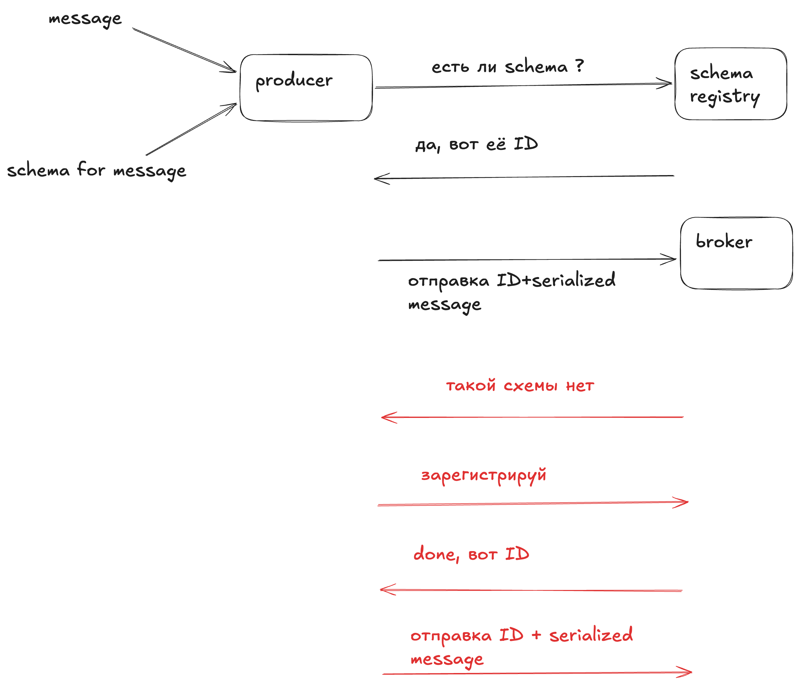
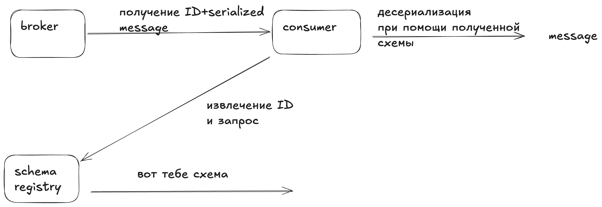

# Сериализация и десериализация данных

**Сериализация** - процесс преобразования языковых объектов в последовательность байт, **десериализация** - обратный процесс, на стороне консьюмера.

Сериализация бывают разного вида:
- строковые/числовые (целочисленные, double)
- байтовые (подддерживаются не всеми языками)
- специализированные:
  - JSON
  - AVRO
  - Protobuf
- кастомные (самостоятельная реализация)

# Schema Registry [SR]

## Добавление SR в docker-compose

```yaml
  schema-registry:
    image: confluentinc/cp-schema-registry:latest
    depends_on:
      kafka:
        condition: service_healthy
      kafka-broker-2:
        condition: service_healthy
    ports:
      - "8081:8081"
    environment:
      SCHEMA_REGISTRY_KAFKASTORE_BOOTSTRAP_SERVERS: PLAINTEXT://kafka:29092,PLAINTEXT://kafka-broker-2:29093
      SCHEMA_REGISTRY_HOST_NAME: schema-registry
      SCHEMA_REGISTRY_LISTENERS: http://0.0.0.0:8081

    healthcheck:
      test: ["CMD-SHELL", "timeout 2 bash -c 'echo > /dev/tcp/localhost/8081' || exit 1"]
      interval: 5s
      timeout: 5s
      retries: 10
      start_period: 30s
```

Полный файл [docker-compose.kafka-add-broker-sr.yaml](../../infra/docker-compose.kafka-add-broker-sr.yaml)

На чем споткнулся:
- `SCHEMA_REGISTRY_KAFKASTORE_BOOTSTRAP_SERVERS` - тут надо указывать внутренние порты, у меня они 2xxxx
- healthcheck:
    - в контейнере нет  curl/apt/nc, итог реализован через bash

Сам контейнер SR поднимался, но в логах не было видно запросов от healthcheck, помогло инспектирование

```bash 
docker inspect infra-schema-registry-1 --format='{{json .State.Health}}' | jq
```

Вывод

```json
{
  "Status": "starting",
  "FailingStreak": 1,
  "Log": [
    {
      "Start": "2026-07-31T07:49:18.13566992Z",
      "End": "2026-07-31T07:49:18.178805128Z",
      "ExitCode": 1,
      "Output": "/bin/sh: line 1: nc: command not found\n"
    },
  ...
  ]
}
```


SR - механизм согласования схемы данных при сложных сценариях.

Schema Registry:
* Поддерживает контроль изменений схем =  совместимость между разными версиями схем.
* Централизация хренения/управления схемами
* Упрощает сериализацию и десериализацию = Потребители могут легко получить схему по ID и использовать её для сериализации и десериализации сообщений.

### Взаимодействие Producer + SR




### Взаимодействие Consumer + SR




## Практическая часть

```
ModuleNotFoundError: No module named 'certifi'
ModuleNotFoundError: No module named 'httpx'
ModuleNotFoundError: No module named 'authlib'
ModuleNotFoundError: No module named 'cachetools'
```


