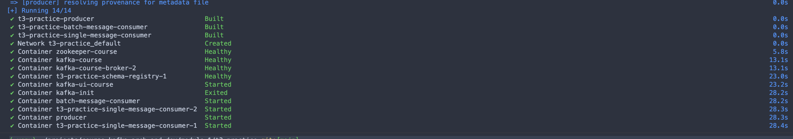
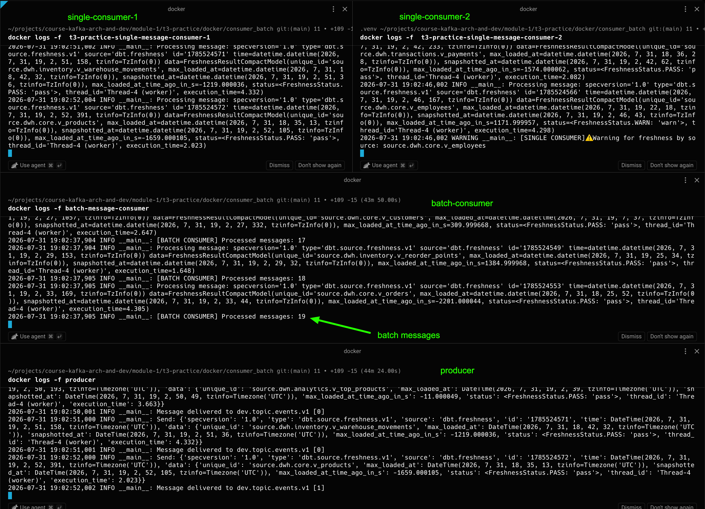
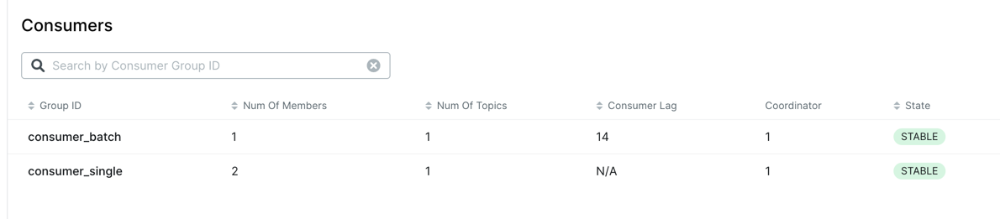
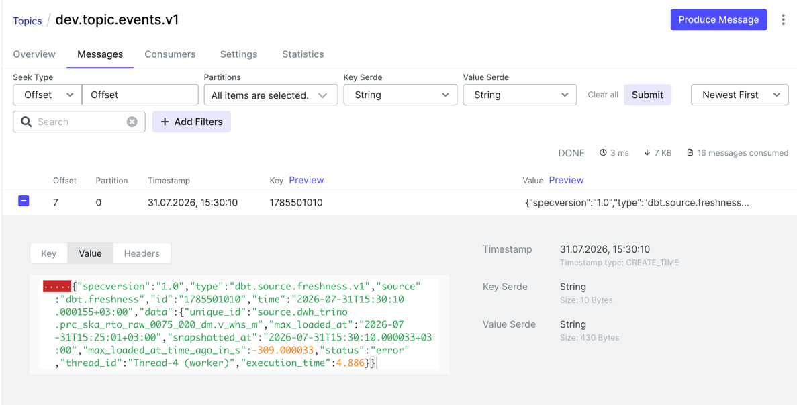

# Практическая работа 2


**Тема работы:** «Настройка кластера и реализация продюсера с двумя консьюмерами». 

**Цель:** применить на практике знания об основах Apache Kafka, укрепить понимание её архитектуры, ключевых компонентов и возможностей.

Дисклеймером практической работы будет иллюстрация к Процессу Кафки (может и не подходит, но не упомянуть имя хорошего автора в свете хорошей технологии было бы грустно)


ps: хотя и курс и обучение - это процесс, но конец у нас всё же перспективнее =)


## Структура

```
.
├── README.md
├── docker
│   ├── consumer_batch
│   │   ├── Dockerfile
│   │   ├── consumer_batch.py
│   │   └── requirements.txt
│   ├── consumer_single
│   │   ├── Dockerfile
│   │   ├── consumer_single.py
│   │   └── requirements.txt
│   └── producer
│       ├── Dockerfile
│       ├── producer.py
│       └── requirements.txt
├── docker-compose.kafka.yaml
└── topics.txt
```

# How to

Быстрый старт таков:

1. Где бы ты ни были, погрузись в терминале в папку `t3-practice`

```bash
cd <your-folder-with-git-project>/course-kafka-arch-and-dev/module-1/t3-practice
```

2. Стартуй docker-compose и наслаждайся ~~низкокалорийным~~ попкорном и отличной работой сервисов

```bash
docker compose -f docker-compose.kafka.yaml up -d
```

Когда увидишь, что всё стартануло:



Переходи в Kafka-UI: http://127.0.0.1:8081 и разглядывай что producer пишет или загляни в логи producer/consumer чтобы видеть, что у них всё ОК

3. Заглянуть в логи

```bash
docker ps | grep ''

docker logs -f <producer-container-name>
docker logs -f <consumer_single-container-name>
```

## Скрин работы



Посмотреть видео работы [practice-2 [откроется в браузере]](https://storage.yandexcloud.net/public-bucket-6/course-kafka-arch-and-dev/practice-2.mp4)


Consumer lag показывает разницу в обработке между single/batch consumer:



У batch копиться лаг.


# Хочешь детали, залетай под кат

## Особенности docker-compose

Для всех контейнеров добавлены healthcheck - хоть как-то приблизимся к production-ready:

- zookeeper

```yaml
    healthcheck:
      test: ["CMD-SHELL", "echo srvr | nc -w 2 localhost 2181 | grep Zookeeper"] 
```

отправляем специальную команду srvr через netcat[nc] клиент, zookeeper отвечает серсвисной инфой, грепаем строку с версией сервиса - если ошибок нет, 
считаем что сервис жив

- брокеры (kafka/kafka-broker-2)

```yaml
    healthcheck:
      test: ["CMD-SHELL", "kafka-broker-api-versions --bootstrap-server localhost:9092 >/dev/null 2>&1"]
```

используем запрос с получением Kafka API версий как сигнал, что всё ок


- schema-registry

```yaml
    healthcheck:
      test: ["CMD-SHELL", "timeout 2 bash -c 'echo > /dev/tcp/localhost/8081' || exit 1"]
```

тут было интересно, ибо стандартные утилиты curl/wget/nc не были доступны в контейнере, честно нагуглился способ через bash


Добавлен контейнер `kafka-init` - cоздаёт топик, чтобы он всегда был после старта кластера:

```yaml
  kafka-init:
    image: confluentinc/cp-kafka:7.6.0
    container_name: kafka-init
    depends_on:
      kafka:
        condition: service_healthy
      kafka-broker-2:
        condition: service_healthy
      schema-registry:
        condition: service_healthy
    command:
      - /bin/bash
      - -c
      - |
        kafka-topics --bootstrap-server kafka:29092,kafka-broker-2:29093 \
          --create \
          --if-not-exists \
          --topic topic.events.v1 \
          --partitions 3 \
          --replication-factor 2
        kafka-topics --describe --topic topic.events.v1 --bootstrap-server kafka:29092,kafka-broker-2:29093
```

Все приложения стартуют после готовности `kafka-init`:

```yaml
    depends_on:
      kafka-init:
        condition: service_completed_successfully
```

Первоначально producer/consumer стартовали после брокеров и schema-registry и было страннное поведение:
- producer отправлял сообщения успешно
- консьюмер падал, тк на момент его запуска топика еще не было


## Producer

Будет не просто, но мы справимся)

### Сообщения

В качестве объектов в коде выбираем pydantic - ибо удобно валидировать/управлять из Python, также удобно получать json-schema.

Для модно-молодежности используем [CloudEvent](https://github.com/cloudevents/spec) в качестве инкапсуляции payload:

```python
class CloudEvent(BaseModel):
    """
    Pydantic модель для сообщения в формате CloudEvents v1.0.
    Документация: https://github.com/cloudevents/spec
    """
    # --- ОБЯЗАТЕЛЬНЫЕ ПОЛЯ ---
    specversion: str = Field(default="1.0", description="Версия спецификации CloudEvents. Всегда '1.0'")
    type: str = Field(default="dbt.source.freshness", description="Тип события (например, 'com.example.someevent')")
    source: str = Field(default="dbt-impala", description="URI, идентифицирующий контекст-источник события")
    id: str = Field(..., description="Уникальный идентификатор события, генерируемый источником")

    # --- ОПЦИОНАЛЬНЫЕ ПОЛЯ ---
    time: datetime | None = Field(None, description="Метка времени события в формате RFC3339")

    # --- ПОЛЕ С ДАННЫМИ ---
    data: FreshnessResultCompactModel | None = Field(None, description="Данные, специфичные для события")
```

Сами данные - это данные о проверки свежести источников (то, что получается по результатам [dbt source freshness](https://docs.getdbt.com/docs/deploy/source-freshness?version=2.0)) в упрощенном виде

```python
class FreshnessResultCompactModel(BaseModel):
    """Компактная модель результата проверки свежести (без вложенных полей)"""
    unique_id: str = Field(..., description="Уникальный идентификатор источника")
    max_loaded_at: datetime = Field(..., description="Максимальное время загрузки данных")
    snapshotted_at: datetime = Field(..., description="Время снятия снэпшота")
    max_loaded_at_time_ago_in_s: float = Field(
        ...,
        description="Время в секундах с момента max_loaded_at (отрицательное - в будущем)"
    )
    status: FreshnessStatus = Field(..., description="Статус проверки: pass/warn/error")
    thread_id: str = Field(..., description="ID потока выполнения")
    execution_time: float = Field(..., description="Общее время выполнения в секундах")
```

FreshnessStatus - выбирается из Enum.

Реальных данных у нас нет, поэтому делаем случайный генератор - `generate_random_freshness_event`:
- все аргументы которые можно делаем случайными
- источники выбираем из списка
- статусы выбираем из списка
- инкапсулируем в наши модели и возвращаем

Код самого producer (сериализатор/отправка) взяты из примера в курсе с адаптацией под pydantic и с обработкой ошибок (try/except).

ps: пока producer живет в 1 файле, читаемость низкая, но пусть остается так


Тест producer, сообщения отправляются:

```bash
...
2026-07-31 15:29:30,043 INFO httpx: HTTP Request: POST http://localhost:8081/subjects/dev.topic.events.v1-value/versions?normalize=False "HTTP/1.1 200 OK"
2026-07-31 15:29:30,043 DEBUG httpcore.http11: receive_response_body.started request=<Request [b'POST']>
2026-07-31 15:29:30,043 DEBUG httpcore.http11: receive_response_body.complete
2026-07-31 15:29:30,043 DEBUG httpcore.http11: response_closed.started
2026-07-31 15:29:30,043 DEBUG httpcore.http11: response_closed.complete
2026-07-31 15:29:30,047 INFO __main__: Send: {'specversion': '1.0', 'type': 'dbt.source.freshness.v1', 'source': 'dbt.freshness', 'id': '1785500970', 'time': DateTime(2026, 7, 31, 15, 29, 30, 723, tzinfo=Timezone('Europe/Moscow')), 'data': {'unique_id': 'source.dwh_trino.prc_knaa_raw_0075_000_cloud.v_d_aum_whs_art_day_m', 'max_loaded_at': DateTime(2026, 7, 31, 15, 33, 24, tzinfo=Timezone('Europe/Moscow')), 'snapshotted_at': DateTime(2026, 7, 31, 15, 29, 30, 405, tzinfo=Timezone('Europe/Moscow')), 'max_loaded_at_time_ago_in_s': 233.999595, 'status': <FreshnessStatus.PASS: 'pass'>, 'thread_id': 'Thread-4 (worker)', 'execution_time': 0.55}}
2026-07-31 15:29:30,051 INFO __main__: Message delivered to dev.topic.events.v1 [0]
2026-07-31 15:29:40,000 INFO __main__: Send: {'specversion': '1.0', 'type': 'dbt.source.freshness.v1', 'source': 'dbt.freshness', 'id': '1785500980', 'time': DateTime(2026, 7, 31, 15, 29, 40, 187, tzinfo=Timezone('Europe/Moscow')), 'data': {'unique_id': 'source.dwh_trino.prc_ska_rto_raw_0075_000_cloud.v_d_aum_whs_art_day_m', 'max_loaded_at': DateTime(2026, 7, 31, 15, 16, 38, tzinfo=Timezone('Europe/Moscow')), 'snapshotted_at': DateTime(2026, 7, 31, 15, 29, 40, 55, tzinfo=Timezone('Europe/Moscow')), 'max_loaded_at_time_ago_in_s': -782.000055, 'status': <FreshnessStatus.PASS: 'pass'>, 'thread_id': 'Thread-4 (worker)', 'execution_time': 3.945}}
2026-07-31 15:29:40,007 INFO __main__: Message delivered to dev.topic.events.v1 [0]
2026-07-31 15:30:00,000 INFO __main__: Send: {'specversion': '1.0', 'type': 'dbt.source.freshness.v1', 'source': 'dbt.freshness', 'id': '1785501000', 'time': DateTime(2026, 7, 31, 15, 30, 0, 189, tzinfo=Timezone('Europe/Moscow')), 'data': {'unique_id': 'source.dwh_trino.prc_knaa_raw_0075_000_cloud.v_d_aum_whs_art_day_m', 'max_loaded_at': DateTime(2026, 7, 31, 15, 9, 59, tzinfo=Timezone('Europe/Moscow')), 'snapshotted_at': DateTime(2026, 7, 31, 15, 30, 0, 38, tzinfo=Timezone('Europe/Moscow')), 'max_loaded_at_time_ago_in_s': -1201.000038, 'status': <FreshnessStatus.ERROR: 'error'>, 'thread_id': 'Thread-4 (worker)', 'execution_time': 2.129}}
2026-07-31 15:30:00,006 INFO __main__: Message delivered to dev.topic.events.v1 [0]
```

До кафки доставляются:




Полный код producer приложения находится тут [producer.py](docker/producer/producer.py), сборка контейнера тут [producer](docker/producer)

У приложения есть настраиваемые параметры, они указываются как переменные среды и могут быть указаны в docker-compose файле:
```yaml
    environment:
      KAFKA_BOOTSTRAP_SERVERS: kafka:29092,kafka-broker-2:29093
      SCHEMA_REGISTRY_URL: http://schema-registry:8081
      KAFKA_TOPIC: dev.topic.events.v1
```


## SingleMessageConsumer

Приложение (код + Dockerfile) тут [consumer_single](docker/consumer_single)

Ознакомился с официальной [докой](https://docs.confluent.io/kafka-clients/python/current/overview.html#basic-poll-loop), пример взят из неё.

Главные методы:
- `consumer.subscribe(topics)` - говорим консьюмеру что читать
- в бесконечном цикле запрашиваем сообщения из топиков

```python
        while running:
            msg = consumer.poll(timeout=1.0)
```

`poll` - обращается к брокерам и опрашивает их на предмет наличия новых сообщений, ждет указанный таймаут (`timeout=1.0`), если за его период сообщений не 
получено, то возвращается пустота


Доработки basic-pool-loop относительно ТЗ:

- логгирование всех ошибок

```python
            if msg.error():
                if msg.error().code() == KafkaError._PARTITION_EOF:
                    # End of partition event
                    logger.error('%% %s [%d] reached end at offset %d\n' %
                                     (msg.topic(), msg.partition(), msg.offset()))
                elif msg.error():
                    # raise KafkaException(msg.error())
                    logger.error(f'Error: {msg.error().code()}')
            else:
                try:
                    message_process(msg)
                except Exception as e:
                    logger.error(f'Error during message processing: {str(e)}')
```

- кастомный обработчик сообщений (просто логируем WARN/ERROR события)

```python
def message_process(message: Message) -> None:
    value = message.value()
    logger.info(f'Processing message: {value}')

    match value.data.status:
        case FreshnessStatus.WARN:
            logger.warning(f'⚠️ Warning for freshness by source: {value.data.unique_id}')
        case FreshnessStatus.ERROR:
            logger.error(f'🚫 Error for freshness by source: {value.data.unique_id}')
        case _:
            pass
```

Всё вместе вызывается в основной функции `main()`:

```python
def main():
    topic = os.getenv("KAFKA_TOPIC", "dev.topic.events.v1")

    # Инициализация клиента Schema Registry
    schema_registry_client = SchemaRegistryClient(schema_registry_config)

    json_deserializer = JSONDeserializer(json.dumps(CloudEvent.model_json_schema()),
                                         lambda data, ctx: CloudEvent(**data),
                                         schema_registry_client,)

    consumer_conf.update({
        'key.deserializer': StringDeserializer('utf_8'),
        'value.deserializer': json_deserializer,
    })

    with DeserializingConsumer(consumer_conf) as consumer:
        basic_consume_loop(consumer=consumer, topics=[topic])
```

настройка десериалайзера, обновление конфигурации консьюмера и использование контекстного мессенджера для консьюмера (узнано из доки)


## BatchMessageConsumer


Приложение (код + Dockerfile) тут [consumer_batch](docker/consumer_batch)

Особенности:
- коммитом теперь управляем сами `'enable.auto.commit': 'false'`
- копим батчи и обрабатываем пачкой

Какие у нас варианты:

`fetch.min.bytes` - минимальное кол-во байт

По свойству `fetch.max.wait.ms` получил ошибку, корректный параметр `fetch.wait.max.ms`
```
cimpl.KafkaException: KafkaError{code=_INVALID_ARG,val=-186,str="No such configuration property: "fetch.max.wait.ms""}
```

для стандартного консьюмера Consumer есть метод, который позволяет получать пачку сообщений

```python
consumer.consume(num_messages=int(os.getenv("MSG_BATCH_SIZE", 10)), timeout=1.0)
```

Итог: остановился на таких настройках

```json
    'fetch.min.bytes': 1048576, # 1MB
    'fetch.wait.max.ms': 30000
```

Batch consumer мало чем отличается от Single, отличия ниже:

```python
# добавился counter для логгирования размера обработанного батча
        while running:
            msg = consumer.poll(timeout=1.0)
            if msg is None:
                counter = 0
                continue

            ...
            else:
                try:
                    message_process(msg)
                    # самостоятельный коммит
                    consumer.commit(asynchronous=False)
                    counter+=1
                except Exception as e:
                    logger.error(f'Error during message processing: {str(e)}')
            
            # вывод в лог размер бачта
            logger.info(f'[BATCH CONSUMER] Processed messages: {counter}')
```


--------------


Про параметр `replicas` не очень понятно из ТЗ к какому приложению применять, выставил для single consumer

```yaml
  single-message-consumer:
    deploy:
      replicas: 2
```

Поведение ожидаемое: тк у каждого экземпляра consumer-group-id один и тот же, то они вычитыают разные сообщения из топика, то есть мы распараллелили обработку

В файле [topics.txt](topics.txt) команды создания топиков и ожидаемый вывод