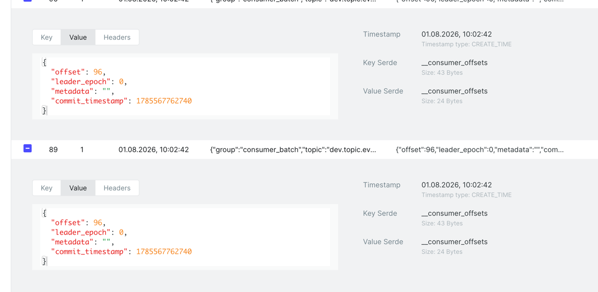

Павел, привет!

Главные замечания:

```
BatchMessageConsumer не реализует пакетную обработку с одним коммитом после пачки. 
это можно сделать так 
msgs = consumer.consume(num_messages=10, timeout=30.0) 
for msg in msgs:
    process(msg)
consumer.commit(asynchronous=False)
или накопить 10 сообщений через poll в цикле
```

Про метод `consumer.consume` писал в ридми, но не раскрыл: этот метод реализован у стандартного консьюмера `from confluent_kafka import Consumer`, 
в моем случае используется `DeserializingConsumer`, этого метода у него нет

```python
    def consume(self, num_messages: int = 1, timeout: float = -1) -> List[Message]:
        """
        :py:func:`Consumer.consume` not implemented, use
        :py:func:`DeserializingConsumer.poll` instead
        """

        raise NotImplementedError
```

Предлагаю альтернативный вариант, просто копим батч по счетчику и коммитим:

```python
                    if counter % batch_size == 0:
                        logger.info('Batch commiting...')
                        consumer.commit(asynchronous=False)
```

Еще заметил комиты одинаковых оффсетов для батч?



Пока не понимаю откуда они берутся.

Настройки консьюмера такие, что он ждет:
```json
    'fetch.min.bytes': 1048576, # 1MB
    'fetch.wait.max.ms': 30000
```

Получается, например, 15 сообщений, начинаем их вычитывать, на 10 делаем комит, дочитываем 5 без комита, счетчик обнуляется только когда дочитаем всё и получим пустоту.
Незакомиченные сообщения в следующий раз опять начнем читать


-------

```
SingleMessageConsumer - auto-commit не будет работать
При enable.auto.offset.store=false нужно после обработки вызывать consumer.store_offsets(message=msg). Сейчас auto-commit коммитит «пустые» stored offsets → гарантия at-least-once для consumer не соблюдается.
```

Недочитал доку) Выставил
```json
'enable.auto.commit': 'true',
'enable.auto.offset.store': 'true',
```

-------

```
незначительное замечание
kafka UI в README — :8081, в compose — :8080 (8081 занят Schema Registry).
```
В ридмишке поправлено


---------

ps: добавил в проект мониторинг (kafka-exporter/prometheus/grafana) под профилем, не должно мешать при обычном запуске